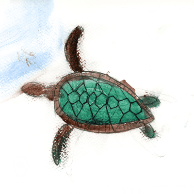

# Turtle Code 🐢

## CLI Program: Encode text in binary, represent by n number of turtle images, export hi-res image for print.
- See the conecpt in interactive action on the webs: https://turtle-encoder.onrender.com/
- I wrote about this project on Medium, read here: https://medium.com/@x_48243/turtle-power-or-an-introduction-to-creating-secret-messages-through-art-and-code-2e6803af0ad2

## What?

- Converts a text message to ordinal numbers to binary to a list of 8-bit binary numbers. 
- Each '0' is represented by a left-facing turtle
- Each '1' is represemted by a right-facing turtle

## How to install and use.
- Clone this repo.
- Make Virtual Environment.
    a. `python3 -m venv venv`
    b. Activate: `source venv/bin/activate`
- Install necessary libraries: `pip install -r requirements.txt`
- Add left-facing turtle images into the `images` folder. 
    - Should all be SQUARE format.
- Run `python3 turtle_encoder.py`
- See below for CLI flags
- Pulls images from the /images folder. So you can drop any left-facing images of whatever creature or object or abstract notion represented in pixels in there. Right now it has the turtles that the students painted in class.

## SAMPLE USAGE with OPTIONAL CLI FLAGS
- `python3 turtle_encoder.py -W 10 -H 8 -C 2 -R 300`
- OR `python3 turtle_encoder.py --width 10 --height 8 --columns 2 --resolution 300`
- Note: width and height in inches. Resolution is DPI (dots per inch)

## Tech

- Python
- Pillow

## Example.

Message: "The Analytical Engine weaves algebraic patterns, just as the Jacquard loom weaves flowers and leaves" -Ada Lovelace

## Design.

The way that I devided to use the images is intentionally designed to iterate through the entire folder of images (i.e. 20 paintings) so that they each is included once, in a random order, before repeating the images in the folder. This is to ensure that there’s an equal distribution of images in the output image. I wouldn’t want one image to be selected 30 times, and another not to show up at all, which is a possibility if it were a completely random algorithm calling on the images in the folder. 

Also, all the turtles were scanned in Photoshop, and flipped horizontally if necessary, to all be left facing as a starting point.

The algorithm flips to the image from left to the right in the case that the image is used to represent a “1”. That way you’ll see the same turtle facing left and right in various places throughout the image. 

The program sorts the turtles into columns, read left to right, top to bottom. I intended this to bring a strong visual dynamic, ordered, to really show the similarities and differences between each image. 

## Utils
- file renamer to scrub names and metadata from images
- take images and put 4 on a page -- for source images in class
- images to animated gif util

## Future ideas/TODO

- Add message in plain text on lower right (?) of output image.
- Flask? --> for endpoint that a React FE can access?
- Adjust row size on image output to center for less text, or adjust columns/rows for longer text Dynamically.

## Notes:

- Read up on resampling images: https://en.wikipedia.org/wiki/Lanczos_resampling