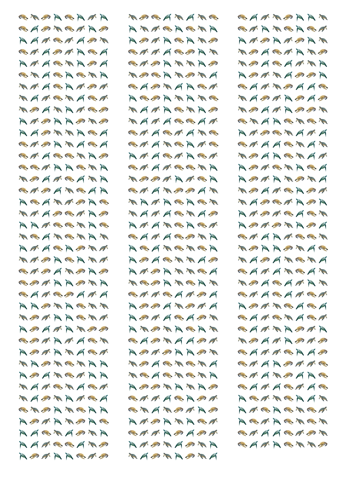

# Turtle Code 🐢

## CLI Program: Encode text in binary, represent by n number of turtle images, export hi-res image for print.
- See the conecpt in interactive action on the webs: https://turtle-encoder.onrender.com/

## What?

- Converts a text message to ordinal numbers to binary to a list of 8-bit binary numbers. 
- Each '0' is represented by a left-facing turtle
- Each '1' is represemted by a right-facing turtle

## How to install and use.
- Clone this repo.
- Make Virtual Environment.
    a. `python3 -m venv venv`
    b. Activate: `source venv/bin/activate`
- Install necessary libraries: `pip install -r requirements.txt`
- Add left-facing turtle images into the `images` folder. 
    - Should all be SQUARE format.
- Run `python3 turtle_encoder.py`
- See below for CLI flags

## SAMPLE USAGE with OPTIONAL CLI FLAGS
- `python3 turtle_encoder.py -W 10 -H 8 -C 2 -R 300`
- OR `python3 turtle_encoder.py --width 10 --height 8 --columns 2 --resolution 300`
- Note: width and height in inches. Resolution is DPI (dots per inch)

## Tech

- Python
- Pillow

## Example.

Message: "The Analytical Engine weaves algebraic patterns, just as the Jacquard loom weaves flowers and leaves" -Ada Lovelace

## Future ideas/TODO

- Add message in plain text on lower right (?) of output image.
- Flask? --> for endpoint that a React FE can access?
- Adjust row size on image output to center for less text, or adjust columns/rows for longer text Dynamically.

## Notes:

- Read up on resampling images: https://en.wikipedia.org/wiki/Lanczos_resampling